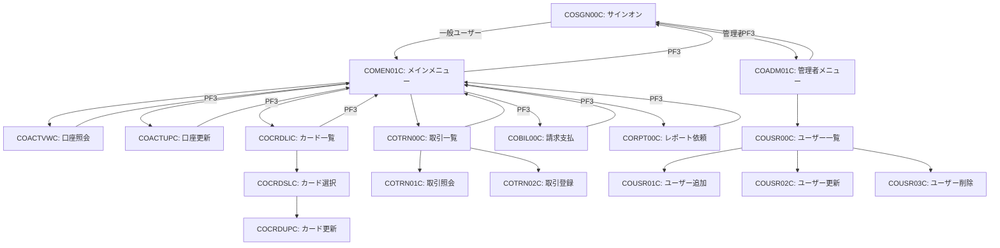
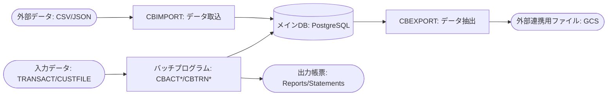

# 基本設計書 (CardDemo Modernization)

## 1. システム概要
### 1.1 目的と背景
本システム (CardDemo) は、クレジットカード管理業務を行うメインフレームアプリケーションである。
本プロジェクトの目的は、このレガシー資産をクラウドネイティブ技術 (Node.js/Java, PostgreSQL) を用いて Google Cloud Platform (GCP) へ移行し、保守性・拡張性を向上させることにある。
既存の COBOL/CICS/VSAM ベースのシステムから、オープンな技術スタックへの移行を通じて、ベンダーロックインの解消と運用コストの最適化を目指す。

### 1.2 全体機能構成
システムは大きく以下の機能群で構成される。
- **アカウント管理:** 顧客およびクレジットカード口座の管理。
- **カード管理:** クレジットカードの発行、照会、更新。
- **トランザクション処理:** カード利用履歴の照会、決済処理。
- **管理機能:** ユーザー管理、システム設定。

## 2. アーキテクチャ設計
### 2.1 現行アーキテクチャ (Mainframe)
- **プラットフォーム:** IBM Mainframe (z/OS)
- **言語:** COBOL
- **オンライン処理:** CICS (Customer Information Control System)
- **データストア:** VSAM (KSDS/ESDS/RRDS), DB2, IMS DB
- **画面:** BMS (Basic Mapping Support) 3270エミュレータ
- **認証:** RACF (Resource Access Control Facility)

### 2.2 移行後アーキテクチャ (Cloud Native)
- **プラットフォーム:** Google Cloud Platform (GCP)
- **実行環境:** Cloud Run または Google Kubernetes Engine (GKE)
- **言語/フレームワーク:**
    - バックエンド: Node.js (TypeScript) / Java (Spring Boot)
    - フロントエンド: React / Angular (Single Page Application)
- **データストア:** Cloud SQL for PostgreSQL
- **通信:** REST API (HTTP/JSON), gRPC
- **非同期処理:** Cloud Pub/Sub (MQの代替)
- **認証:** IDaaS (Cognito / Auth0) または Cloud IAM

## 3. 機能設計
### 3.1 オンライン処理概要
#### 機能一覧
| カテゴリ | 機能名 | 対応プログラム | 概要 |
|---|---|---|---|
| 共通 | サインオン | COSGN00C | ユーザー認証とセッション開始 |
| 共通 | メインメニュー | COMEN01C | 一般ユーザー向け機能のポータル |
| 共通 | 管理者メニュー | COADM01C | 管理者向け機能（ユーザー管理等）のポータル |
| アカウント | 口座照会 | COACTVWC | アカウントの詳細情報の表示 |
| アカウント | 口座更新 | COACTUPC | アカウント情報（残高、限度額等）の修正 |
| カード | カード一覧 | COCRDLIC | ユーザーに紐付くカードの一覧表示 |
| カード | カード選択 | COCRDSLC | 特定のカードの選択と詳細への遷移 |
| カード | カード更新 | COCRDUPC | カードの有効期限やステータスの管理 |
| トランザクション | 取引一覧 | COTRN00C | 取引履歴の検索と一覧表示 |
| トランザクション | 取引照会 | COTRN01C | 特定の取引の詳細情報の表示 |
| トランザクション | 取引登録 | COTRN02C | 新規取引の手動入力 |
| 決済 | 請求支払 | COBIL00C | カード利用代金の支払い処理 |
| レポート | レポート依頼 | CORPT00C | 各種帳票の出力要求 |
| ユーザー管理 | ユーザー一覧 | COUSR00C | (管理者用) ユーザーアカウントの一覧 |
| ユーザー管理 | ユーザー追加 | COUSR01C | (管理者用) 新規ユーザーの登録 |
| ユーザー管理 | ユーザー更新 | COUSR02C | (管理者用) ユーザー情報の修正 |
| ユーザー管理 | ユーザー削除 | COUSR03C | (管理者用) ユーザーアカウントの無効化/削除 |

#### 画面遷移概要

1.  **認証:** 起動時は「サインオン」画面を表示。認証成功後、権限に応じて「メインメニュー」または「管理者メニュー」へ遷移。
2.  **業務フロー:** 各メニューから目的の業務機能（口座照会、取引一覧等）を選択して遷移。
3.  **戻り遷移:** 各画面で PF3 キーを押下することで、一つ前のメニューまたは画面へ戻る。
4.  **ログアウト:** メニュー画面で PF3 を押下することでサインオン画面へ戻り、ログアウトとする。

### 3.2 バッチ処理概要
#### 機能一覧
| カテゴリ | 機能名 | 対応プログラム | 概要 |
|---|---|---|---|
| 更新処理 | アカウント更新 | CBACT01C-03C | 夜間バッチ等による口座情報のバッチ更新 |
| 更新処理 | 利息計算 | CBACT04C | 月末等のタイミングでの利息計算と適用 |
| 更新処理 | 顧客情報更新 | CBCUS01C | 外部データ等に基づく顧客情報の反映 |
| 取引処理 | 取引データ処理 | CBTRN01C-02C | 取引ファイルの読み込み、バリデーション、DB反映 |
| 取引処理 | 取引レポート作成 | CBTRN03C | 日次取引集計レポートの生成 |
| 明細発行 | 利用明細作成 | CBSTM03A-03B | 顧客向けの利用代金明細データの生成 |
| データ連携 | エクスポート | CBEXPORT | DB/VSAM データを外部連携用に抽出 |
| データ連携 | インポート | CBIMPORT | 外部データをシステム内へ取り込み |

#### ジョブフロー概要

1.  **入力フェーズ:** 外部システムや他バッチが生成した順編成ファイル（TRANSACT, CUSTFILE 等）を読み込む。
2.  **処理フェーズ:** ユーティリティ (CSUTLDTC 等) を使用しながら日付計算や妥当性チェックを行い、ビジネスロジックを実行。
3.  **更新フェーズ:** 処理結果をメインデータベース (PostgreSQL) へ反映、または VSAM 代替のファイルへ書き出す。
4.  **出力フェーズ:** 帳票データやエクスポート用ファイルを生成し、後続処理へ引き渡す。

## 4. データ設計
### 4.1 データベース構成概要
移行後のデータベースは PostgreSQL を採用し、以下の主要テーブルで構成する。
- **Customer:** 顧客基本情報 (ID, 氏名, 住所, 連絡先)
- **Account:** 口座情報 (ID, 残高, 限度額, ステータス)
- **Card:** カード情報 (番号, 有効期限, 紐付け口座)
- **Transaction_History:** 取引履歴 (日時, 金額,加盟店)
- **Auth_Fraud:** 不正利用検知データ
- **Reference Data:** 取引種別、カテゴリ等のマスタデータ

各テーブルは VSAM および DB2 から移行され、適切な外部キー制約とインデックスにより整合性と性能を確保する。

### 4.2 入出力ファイル概要
現行の VSAM ファイルは基本的に RDB テーブルへ移行する。
バッチ処理で発生する中間ファイルや帳票データについては、Google Cloud Storage (GCS) 上のオブジェクト、またはデータベース内の一時テーブルとして扱う。

## 5. 外部インターフェース設計
### 5.1 システム間連携概要
- **API連携:** フロントエンドとバックエンド、およびマイクロサービス間は REST API または gRPC で連携する。
- **メッセージング:** 外部システムや非同期処理（承認フロー等）との連携には Cloud Pub/Sub を使用する。MQ メッセージのフォーマットは JSON 等のオープンな形式に変換する。

## 6. 移行方針
### 6.1 アプリケーション移行方針
- **言語転換:** COBOL ロジックを Node.js (TypeScript) または Java (Spring Boot) にリライトする。共通コピーブックはクラス/型定義として定義し直す。
- **UI刷新:** BMS 画面を React 等の SPA (Single Page Application) に置き換える。画面レイアウトは 80x24 の制限から解放し、モダンな UX/UI デザインを適用する。
- **オンライン基盤:** CICS の機能を RESTful な Web API サーバーで代替する。トランザクション管理はデータベースの ACID 特性を利用して実装する。
- **バッチ基盤:** JCL によるジョブ実行を、Cloud Scheduler や Argo Workflows 等のクラウドネイティブなジョブスケジューラへ移行する。

### 6.2 データ移行方針
- **ファイルから RDB へ:** VSAM ファイルを PostgreSQL のテーブルに完全移行する。固定長レコードから正規化されたリレーショナルモデルへのマッピングを行う。
- **文字コード:** EBCDIC から UTF-8 への変換を行う。特に日本語や特殊文字の扱いに注意する。
- **移行手順:** 初期データ移行 (Bulk Load) を行い、移行期間中はバッチファイルを利用したデルタ更新（差分同期）を検討する。